[TOC]

# 第一章

极化面电荷:
$$
\sigma_{\mathbf{P}}=\mathbf{P}\cdot \mathbf{e_n}
$$
极化体电荷:
$$
\rho_{\mathbf{P}}=-\nabla\cdot \mathbf{P}
$$
极化电荷代数和应为0:
$$
0=\oint_{S}{\sigma_{\mathbf{P}}dS}+\int_V{\rho_{\mathbf{P}}dV}
$$
在理想电介质中:
$$
\mathbf{D}=\varepsilon_0\mathbf{E}+\mathbf{P}=\varepsilon\mathbf{E}
$$
电通量连续性:
$$
\mathbf{D_{n2}}-\mathbf{D_{n1}}=\mathbf{\sigma}
$$
电位连续性、E的切向连续性:
$$
E_{1t}=E_{2t}
$$
静电场折射定律(理想介质、分界面上无自由电荷):
$$
\frac{\tan\alpha_1}{\tan\alpha_2}=\frac{\varepsilon_1}{\varepsilon_2}
$$
电像法

导体球

$$
b=\frac{R^2}{d} \\
q'=\frac{R}{d}q
$$
两种理想介质
在$r_1=r_2$处

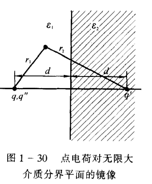
$$
\left\{ \begin{array}{l}
	\frac{q}{\varepsilon_1}+\frac{q'}{\varepsilon_1}=\frac{q''}{\varepsilon_2}\\
	q-q'=q''\\
\end{array} \right.
$$

$$
\therefore 
\left\{ \begin{array}{l}
q'=\frac{\varepsilon_1-\varepsilon_2}{\varepsilon_1+\varepsilon_2}q\\
q''=\frac{2\varepsilon_2}{\varepsilon_1+\varepsilon_2}q\\
\end{array} \right.
$$

几个电容公式

同轴夹层线缆
$$
C=\frac{2\pi\varepsilon}{\ln(b/a)}
$$
同心夹层球
$$
C=\frac{4\pi\varepsilon}{\frac{1}{a}-\frac{1}{b}}
$$
孤立球
$$
C=4\pi\epsilon_0a
$$
静电场能量

介质各处均匀线性充电，容易想到
$$
\begin{align}
W_e&=\frac{1}{2}\int_V\rho\varphi dV \\
   &=\frac{1}{2}\int_S\sigma\varphi dS
\end{align}
$$
静电场能量密度
$$
w'_e=\frac{1}{2}\mathbf{D}\cdot \mathbf{E}
$$
虚功原理
$$
dW=dW_e+fdg
$$
不与电源相连
$$
0=dW_e+fdg \\
\therefore f=-\frac{\part W_e}{\part g}
$$
与电源相连,各带电体电位不变
$$
dW_e=\frac{1}{2}\sum_k\varphi_k dq_k=\frac{1}{2}dW \\
\therefore f=\frac{\part W_e}{\part g}
$$

# 第二章

电流密度
$$
\mathbf{J}=\rho\mathbf{v}
$$
作用于垂直于$v$的$dS$
$$
dI=\mathbf{J}\cdot d\mathbf{S}
$$
面电流密度
$$
\mathbf{K}=\sigma \mathbf{v}
$$
作用于垂直于$v$的$dl$
$$
dI=\mathbf{K}\cdot \mathbf{e_n}dl
$$
线电流密度
$$
I=\tau v
$$
四种电流元
$$
\mathbf{v}dq=\mathbf{J}dV=\mathbf{K}dS=Id\mathbf{l}
$$
欧姆定律微分形式
$$
\mathbf{J}=\gamma \mathbf{E} \\
\gamma为电导率
$$
焦耳定律微分形式
$$
p=\frac{dP}{dV}=\mathbf{J}\cdot \mathbf{E}
$$
含源欧姆定律
$$
\mathbf{J}=\gamma (\mathbf{E}+ \mathbf{E_e})
$$
电流连续性方程
$$
\oint_S \mathbf{J}\cdot d\mathbf{S}=-\frac{\part q}{\part t}=0
$$
衔接条件
$$
\mathbf{J_{1n}}=\mathbf{J_{2n}},体现一个电荷守恒\\
\mathbf{E_{1t}}=\mathbf{E_{2t}},体现一个保守场 \\
\frac{\tan \alpha_1}{\tan \alpha_2}=\frac{\gamma_1}{\gamma_2},谓之折射定律
$$

# 第三章

BS定律
$$
\begin{align}
\mathbf{B}&=\frac{\mu}{4\pi}\oint_L{\frac{Id\mathbf{l}\cross\mathbf{e_R}}{R^2}} \\
&=\frac{\mu}{4\pi}\oint_V{\frac{\mathbf{J}dV\cross\mathbf{e_R}}{R^2}} \\
&=\frac{\mu}{4\pi}\oint_S{\frac{\mathbf{K}dS\cross\mathbf{e_R}}{R^2}} \\
&B在场点,其余均在源点
\end{align}
$$
安培力
$$
d\mathbf{F}=Id\mathbf{l}\cross\mathbf{B}
$$
安培环路定律
$$
\nabla\cross \mathbf{H}=\mathbf{J} \\
\oint_L\mathbf{H}\cdot d\mathbf{l}=\sum_k{I_k}
$$
## 有介质

分子磁矩

$$
\mathbf{m}=I\mathbf{S}
$$
磁力矩
$$
\mathbf{T}=\mathbf{m}\cross\mathbf{B}
$$
磁化强度
$$
\mathbf{M}=\lim_{\Delta V\rightarrow 0}\frac{\sum_i{\mathbf{m_i}}}{\Delta V} \\
理想介质中,\mathbf{M}=\chi_m\mathbf{H} ,\chi_m是磁化率 \\
$$
磁化电流
$$
I_m=\oint_L{\mathbf{J_m}\cdot d\mathbf{l}} \\
\mathbf{J_m}=\nabla \cross \mathbf{M}
$$
磁化强度衔接条件

$$
(\mathbf{M_1}-\mathbf{M_2})\cross\mathbf{e_n}=\mathbf{K_m}
$$
磁场强度
$$
\mathbf{H}=\mathbf{\frac{B}{\mu_0}-M} \\
\mathbf{B}=\mu \mathbf{H}(理想介质) \\
\nabla \cross\mathbf{H}=\mathbf{J},自由电流密度,安培环路定律2.0 \\
$$
不存在磁单极子,磁场是无源的
$$
\nabla \cdot \mathbf{B}=0 (微分形式) \\
\oint_S\mathbf{B}\cdot d\mathbf{S}=0(积分形式)
$$

衔接条件、折射定律

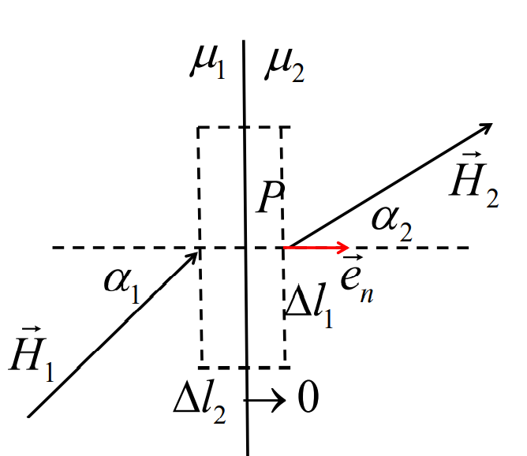

考虑安培环路定律$\nabla \cross\mathbf{H}=\mathbf{J}$:
$$
\mathbf{(H_1-H_2)\cross e_n}=\mathbf{K} \\
H_{1t}-H_{2t}=K,分量形式
$$
磁场无源:
$$
\mathbf{(B_1-B_2)\cdot e_n}=0\\
\mathbf{B_{1n}=B_{2n}} ,分量形式\\
$$
折射定律
$$
理想介质,无面电流 \\
\frac{\tan\alpha_1}{\tan\alpha_2}=\frac{\mu_1}{\mu_2}
$$

## 磁矢位

磁场无源,所以将$\mathbf{B}$看做一个场的旋度场(旋度无散)
$$
\mathbf{B}=\nabla\cross\mathbf{A} \\
称\mathbf{A}为磁矢位
$$

代入安培环路定律和磁场构造方程
$$
\nabla \cross \nabla \cross \mathbf{A}=\mu \mathbf{J} \\
$$
利用矢量恒等式,并令$\nabla \cdot \mathbf{A}=\mathbf{0}$(库伦规范条件),得到一个三维泊松方程
$$
\nabla^2\mathbf{A}=-\mu\mathbf{J}
$$
类比静电场的泊松方程的解
$$
\begin{align}
\mathbf{A}&=\frac{\mu}{4\pi}\int_{V'}\frac{\mathbf{J}dV'}{R}\\
&=\frac{\mu}{4\pi}\int_{S'}\frac{\mathbf{K}dS'}{R} \\
&=\frac{\mu}{4\pi}\oint_{L'}\frac{Id\mathbf{l}'}{R}
\end{align}
$$
衔接方程
$$
\mathbf{A_1=A_2} \\
\frac{1}{\mu_1}\frac{\partial A_1}{\partial n}-\frac{1}{\mu_2}\frac{\partial A_2}{\partial n}=K , 平行平面场
$$
 镜像法 

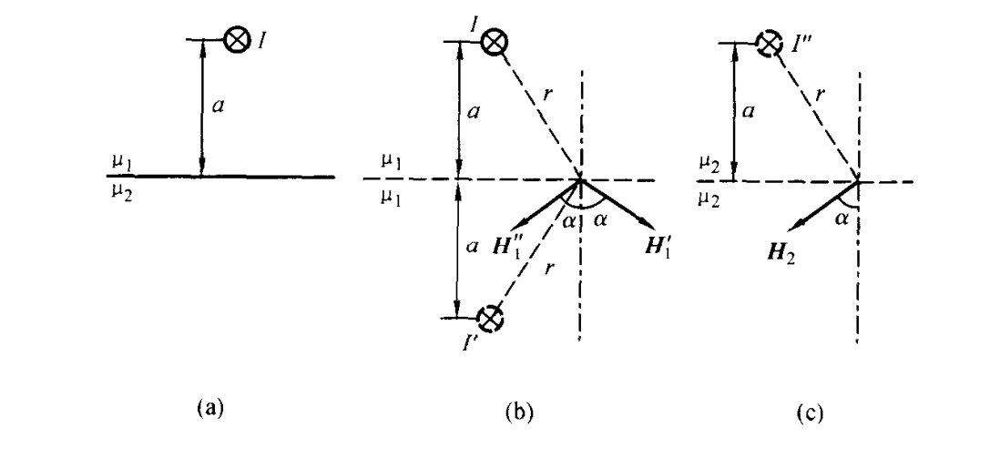

由衔接条件
$$
\frac{I}{2\pi r}\sin\alpha-\frac{I'}{2\pi r}\sin\alpha=\frac{I''}{2\pi r}\sin\alpha \\
\mu_1(\frac{I}{2\pi r}\cos\alpha+\frac{I'}{2\pi r}\cos\alpha)=\mu_2\frac{I''}{2\pi r}\cos\alpha
$$
解得
$$
I'=\frac{\mu_2-\mu_1}{\mu_1+\mu2}I \\
I''=\frac{2\mu_1}{\mu_1+\mu_2}I
$$
Neumann公式

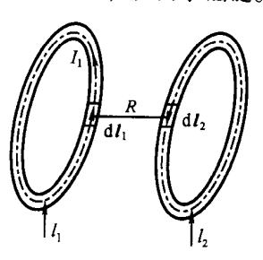
$$
M_{12}=M_{21}=\frac{N_1N_2\mu}{4\pi}\oint_{L_1}\oint_{L_2}\frac{\mathbf{dl_1\cdot dl_2}}{R}
$$
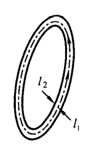
$$
\begin{align}
&L_o=\frac{N^2\mu}{4\pi}\oint_{L_1}\oint_{L_2}\frac{\mathbf{dl_1\cdot dl_2}}{R} \\
&L=L_i+L_o \approx L_o \\
&L_i \approx \frac{\mu l}{8\pi}
\end{align}
$$

# 第四章

## 含时Maxwell's Equation

涡旋电场
$$
\nabla \cross \mathbf{E}=-\frac{\partial \mathbf{B}}{\partial t}+\nabla \cross (\mathbf{v}\cross \mathbf{B})
$$
在静止媒质中$\mathbf{v}=\mathbf{0}$
$$
\nabla \cross \mathbf{E}=-\frac{\partial \mathbf{B}}{\partial t}
$$
全电流定律

位移电流
$$
\mathbf{J_d}=\frac{\partial \mathbf{D}}{\partial t}
$$

$$
\nabla \cross \mathbf{H}=\mathbf{J}+\mathbf{J_d}=\mathbf{J}+\frac{\partial \mathbf{D}}{\partial t}
$$

理想导体边界条件

导体内部(静电屏蔽)
$$
\mathbf{E_1}=\mathbf{0} \\
\mathbf{B_1}=\mathbf{0}
$$
导体外部(衔接方程)
$$
(\mathbf{E_1}-\mathbf{E_2})\cross\mathbf{e_n}=\mathbf{0} \Rightarrow E_{2t}=0 \\
(\mathbf{H_1}-\mathbf{H_2})\cross\mathbf{e_n}=\mathbf{K} \Rightarrow B_{2t}=K \\
(\mathbf{D_1}-\mathbf{D_2})\cdot\mathbf{e_n}=\mathbf{\sigma} \Rightarrow D_{2n}=\sigma \\
(\mathbf{B_1}-\mathbf{B_2})\cdot\mathbf{e_n}=0 \Rightarrow B_{2n}=0 \\
$$
导体附近$\mathbf{E}$线垂直于表面,$\mathbf{B}$线平行于表面

## 动态位

$$
\mathbf{E}+\frac{\partial \mathbf{A}}{\partial{t}}=-\nabla\varphi
$$

于是

$$
\begin{align}
&\mathbf{E}=-\nabla \varphi -\frac{\partial \mathbf{A}}{\partial t} \\
&\mathbf{B}=\nabla \cross \mathbf{A}
\end{align}
$$

达朗贝尔方程
$$
\Box=\nabla^2 -\mu\varepsilon\frac{\partial^2}{\partial t^2}=\nabla^2 -\frac{1}{c^2}\frac{\partial^2}{\partial t^2} \\
\Box \mathbf{A}=-\mu \mathbf{J} \\
\Box \varphi =-\frac{\rho}{\varepsilon}
$$
洛伦兹规范条件
$$
\nabla \cdot \mathbf{A}+\frac{1}{c^2}\frac{\partial \varphi}{\partial t}=0
$$
达朗贝尔方程的解
$$
R=|\mathbf{r-r'}|\\
\varphi(\mathbf{r},t)=\frac{1}{4\pi\varepsilon}\int_{V'}{\frac{\rho(\mathbf{r}',t-\frac{R}{c})dV'}{R}} \\
\mathbf{A}(\mathbf{r},t)=\frac{\mu}{4\pi}\int_{V'}{\frac{\mathbf{J}(\mathbf{r}',t-\frac{R}{c})dV'}{R}} \\
$$

## 电磁场能量

波印廷定理(能量守恒)
$$
\frac{\partial W}{\partial t}=-\oint_{\part V}{\mathbf{E\cross H}\cdot \mathbf{dS}}+\int_V{\mathbf{E_e\cdot J}dV}-\int_V{\frac{\mathbf{J}^2}{\gamma}dV}
$$

> 电磁场能量变化=-电磁波向外辐射+电源提供-焦耳热

波印廷矢量
$$
\mathbf{S}=\mathbf{E}\cross\mathbf{H}
$$

## 正弦电磁场

$$
\mathbf{E}(x,y,z,t)=\Re[\sqrt{2}\mathbf{\dot{E}}(x,y,z)e^{j\omega t}]\\
\mathbf{\dot{E}}(x,y,z)=\sum_{i\in\{x,y,z\}}{\frac{1}{\sqrt{2}}E_{mi}e^{j\phi_i}\mathbf{e_i}}
$$

波印廷矢量均值
$$
\mathbf{S_{av}}=(\mathbf{E}\cross \mathbf{H})\cos(\phi_E-\phi_B)\\
$$
复波印廷矢量
$$
\dot{\mathbf{S}}=\dot{\mathbf{E}}\cross\dot{\mathbf{H}}^* \\
\mathbf{S_{av}}=\Re[\dot{\mathbf{S}}]
$$
波印廷定理复数形式
$$
j\omega\int_V{\mu|\mathbf{\dot{H}}|^2+\varepsilon|\mathbf{\dot{E}^2}|dV}=-\oint_{\partial V}\mathbf{\dot{E}}\cross \mathbf{\dot{H}} \cdot \mathbf{dS}-\int_V{\frac{|\mathbf{\dot{J}}|^2}{\gamma}dV}+\int_V{\mathbf{\dot{E}_e}\cdot \mathbf{\dot{J}^*}dV}
$$

达朗贝尔方程的复数形式
$$
\nabla^2\mathbf{\dot{A}}+\beta^2\mathbf{\dot{A}}=-\mu\mathbf{\dot{J}} \\
\nabla^2\dot{\varphi}+\beta^2\dot{\varphi}=-\frac{\dot{\rho}}{\varepsilon}\\
其中\beta=\omega\sqrt{\mu\varepsilon}=\frac{\omega}{c}=\frac{2\pi}{\lambda}
$$
洛伦兹规范条件复数形式
$$
\nabla\cdot\mathbf{\dot{A}}+j\omega\mu\varepsilon\dot{\varphi}=0
$$
动态位复数形式
$$
\begin{align}
\mathbf{\dot{E}}&=-\nabla\dot{\varphi}-j\omega\mu\varepsilon\mathbf{\dot{A}} \\
&=\frac{\nabla(\nabla\cdot \mathbf{\dot{A}})}{j\omega\mu\varepsilon}-j\omega\mu\varepsilon\mathbf{\dot{A}} \\ \\
\mathbf{\dot{B}}&=\nabla\cross \mathbf{\dot{A}}\\
\end{align}
$$
达朗贝尔方程的复数解
$$
R=|\mathbf{r-r'}|\\
\dot{\varphi}=\frac{1}{4\pi\varepsilon}\int_{V'}{\frac{\dot{\rho}e^{-j\frac{2\pi R}{\lambda}} dV'}{R}} \\
\mathbf{\dot{A}}=\frac{\mu}{4\pi}\int_{V'}{\frac{\mathbf{\dot{J}}e^{-j\frac{2\pi R}{\lambda}}dV'}{R}}
$$
似稳条件
$$
\frac{2\pi R}{\lambda}<<1
$$

## 单元偶极子的辐射

$$
P=\frac{2\pi\mu c}{3}I^2(\frac{\Delta l}{\lambda})^2\approx80\pi^2I^2(\frac{\Delta l}{\lambda})^2
$$

方向性因子
$$
f(\theta,\phi)=\sin\theta
$$

# 准静态电磁场

电准静态场
磁场的变化率约等于0
$$
\frac{\partial \mathbf{B}}{\partial t}\approx \mathbf{0}
$$

磁准静态场
电场的变化率约等于0
$$
\frac{\partial \mathbf{B}}{\partial t}\approx \mathbf{0}
$$
以下关系成立
$$
\nabla ^2\mathbf{H}- \mu \gamma \frac{\part \mathbf{H}}{\part t}=\mathbf{0} \\
\nabla ^2\mathbf{E}- \mu \gamma \frac{\part \mathbf{E}}{\part t}=\mathbf{0} \\
\nabla ^2\mathbf{J}- \mu \gamma \frac{\part \mathbf{J}}{\part t}=\mathbf{0} \\
$$
电流的集肤效应

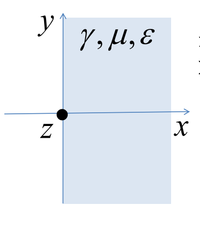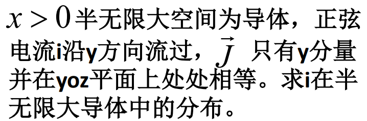
$$
\frac{\part^2 \dot{J_y}}{\part x^2}=\dot{j}\omega\mu \gamma J_y \\
定义 k=\sqrt{j\omega \mu\gamma}=\alpha+j\beta \\
\alpha =\beta =\sqrt{\frac{\omega \mu \gamma}{2}} \\
\dot{J_y}=\dot{J_0}e^{-\alpha x}e^{-j \beta x} \\
$$
透入深度
$$
|e^{-kd}|=|e^{-1}|\\
\alpha d=1 \\
d=\frac{1}{\alpha} =\sqrt{\frac{2}{\omega \mu \gamma}}
$$

# TEM波

## 理想介质中在$x$方向上传播的TEM波

$$
\frac{\part^2 E_y}{\part x^2}-\mu\varepsilon\frac{\part^2E_y}{\part t^2}=0 \\
\frac{\part^2 H_z}{\part x^2}-\mu\varepsilon\frac{\part^2H_z}{\part t^2}=0 \\
$$

$E$和$H$的关系
$$
\frac{E_y^+(x,t)}{H_z^+(x,t)}=\sqrt{\frac{\mu}{\varepsilon}} \\
\frac{E_y^-(x,t)}{H_z^-(x,t)}=-\sqrt{\frac{\mu}{\varepsilon}} \\
Z_0=\sqrt{\frac{\mu}{\varepsilon}}
$$
正弦波
$$
\dot{\mathbf{E}}(x,t)=\dot{E}_{y0}e^{-kx}\mathbf{e_x} \\
k=j\beta=j\frac{\omega}{c}
$$

## 导电介质

$$
\frac{\part^2 E_y}{\part x^2}-\mu\gamma\frac{\part E_y}{\part t}-\mu\varepsilon\frac{\part^2E_y}{\part t^2}=0\\
\frac{\part^2 H_z}{\part x^2}-\mu\gamma\frac{\part H_z}{\part t}-\mu\varepsilon\frac{\part^2H_z}{\part t^2}=0
$$

等效介电常数
$$
\varepsilon'=\varepsilon+\frac{\gamma}{j\omega}
$$

$$
k=j\omega\sqrt{\mu\varepsilon'}
$$

波印廷矢量的均值
$$
\mathbf{\dot{S}_av}=\Re[\mathbf{\dot{E}}\cross \mathbf{\dot{H}^*}]=\frac{1}{|Z_0|}{E_0^+}^2e^{-2\alpha x}\cos\phi \mathbf{e_x} \\
\phi=\arg \sqrt{\frac{\mu}{\varepsilon'}}
$$
极化
$$
\phi_z-\phi _y=\frac{\pi}{2} ,右旋 \\
\phi_z-\phi _y=-\frac{\pi}{2} ,左旋 \\
$$

## 反射与折射

平行极化波

反射系数
$$
\Gamma_\parallel =\frac{E_\parallel^-}{E_\parallel^+}=\frac{Z_{02}\cos\theta_2-Z_{01}\cos\theta_1}{Z_{02}\cos\theta_2+Z_{01}\cos\theta_1}=\frac{\tan(\theta_1-\theta_2)}{\tan(\theta_1+\theta_2)}
$$
折射系数
$$
T_\parallel =\frac{E_\parallel'}{E_\parallel^+}=\frac{2Z_{02}\cos\theta_1}{Z_{02}\cos\theta_2+Z_{01}\cos\theta_1}=\frac{2\sin\theta_2\cos\theta_1}{\sin(\theta_1+\theta_2)\cos(\theta_1-\theta_2)}
$$
垂直极化波

反射系数
$$
\Gamma_\bot =\frac{E_\bot^-}{E_\bot^+}=\frac{Z_{02}\cos\theta_1-Z_{01}\cos\theta_2}{Z_{02}\cos\theta_1+Z_{01}\cos\theta_2}
$$
折射系数
$$
T_\parallel =\frac{E_\parallel'}{E_\parallel^+}=\frac{2Z_{02}\cos\theta_1}{Z_{02}\cos\theta_1+Z_{01}\cos\theta_2}
$$

理想导体处反射
$$
E^-=-E^+ \\
H^-=H^+ \\
e.g.E_y^+=E_m\cos(\omega t-\beta x)\\
H_z^+=\frac{E_m}{Z_0}\cos(\omega-\beta x)\\
E_y^-=-E_m\cos(\omega t+\beta x)\\
H_z^-=\frac{E_m}{Z_0}\cos(\omega t+\beta x)\\
$$
理想介质反射、折射
$$
\Gamma=\frac{Z_{02}-Z_{01}}{Z_{02}+Z_{01}} \\
T=\frac{2Z_{02}}{Z_{02}+Z_{01}} \\
若\dot{E}^+(x)=\dot{E}^+e^{-j\beta_1 x} \\
则\dot{H}^+(x)=\frac{\dot{E}^+}{Z_{01}}e^{-j\beta_1 x} \\
\dot{E}^-(x)=\Gamma\dot{E}^+e^{+j\beta_1 x} \\
\dot{H}^-(x)=-\frac{\Gamma\dot{E}^+}{Z_{01}}e^{j\beta_1 x} \\
\dot{E}'(x)=T\dot{E}^+e^{-j\beta_2 x} \\
\dot{H}'(x)=\frac{T\dot{E}^+}{Z_{02}}e^{-j\beta_2 x} \\
$$
合成电场
$$
\dot{E}(x)=\dot{E}^++\dot{E}^- \\
为行驻波,极值为|\dot{E}^+|(1\pm|\Gamma|) \\
定义驻波比S=\frac{1+|\Gamma|}{1-|\Gamma|}
$$

# 传输线

$L_0$是单位长度的电感

$C_0$是单位长度的电容
$$
L_0C_0=\mu\varepsilon
$$
电报方程
$$
\frac{\part U}{\part z}+L_0\frac{\part I}{\part t}=0 \\
\frac{\part I}{\part z}+C_0\frac{\part U}{\part t}=0 \\
$$
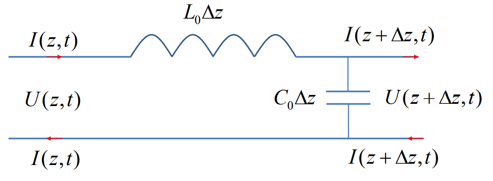

传输线波动方程
$$
\frac{\part^2 U}{\part z^2}-L_0C_0\frac{\part^2 U}{\part t^2}=0 \\
\frac{\part^2 I}{\part z^2}-L_0C_0\frac{\part^2 I}{\part t^2}=0 \\
$$
传播速度
$$
v=\frac{1}{\sqrt{L_0C_0}}
$$
传输线特性阻抗
$$
Z=\sqrt{\frac{L_0}{C_0}}
$$
电压波与电流波
$$
U(z,t)=U^+(t-\frac{z}{v})+U^-(t+\frac{z}{v}) \\

I(z,t)=I^+(t-\frac{z}{v})+I^-(t+\frac{z}{v}) \\

I(z,t)=\frac{1}{Z_0}[U^+(t-\frac{z}{v})-U^-(t+\frac{z}{v})]
$$
正弦稳态解
$$
令k^2=(j\omega)^2L_0C_0 \\
解得\left\{ \begin{array}{l}
	\dot{U}(x,t)=\dot{U}^+e^{-kt}+\dot{U}^-e^{kt}\\
	\dot{I}(x,t)=\frac{\dot{U}^+}{Z_0}e^{-kt}-\frac{\dot{U}^-}{Z_0}e^{kt}\\
\end{array} \right.
$$
若已知端始电压电流$\dot{U}(-l),\dot{I}(-l)$
$$
\dot{U}^+=\frac{1}{2}(\dot{U}_1+Z_0\dot{I}_1)e^{-j\beta l} \\
\dot{U}^-=\frac{1}{2}(\dot{U}_1-Z_0\dot{I}_1)e^{j\beta l} \\
\left\{ \begin{array}{l}
	\dot{U}(z)=\dot{U}_1\cos\beta(l+z)-jZ_0\dot{I}_1\sin\beta(l+z)\\
	\dot{I}(z)=\dot{I}_1\cos\beta(l+z)-j\frac{\dot{U}_1}{Z_0}\sin\beta(l+z)\\
\end{array} \right.
$$
平行板传输线
$$
C_0=\frac{\varepsilon S}{d\Delta z}=\frac{\varepsilon W}{d} \\
d是板间距离\\
W是板的宽度
$$

## 反射与透射

反射原因:传输线阻抗$\ne$负载阻抗,传输线1阻抗$\ne$传输线1阻抗

### 带负载

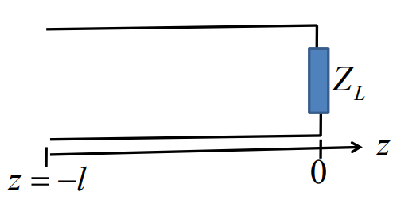

负载阻抗
$$
Z_L=\frac{\dot{U}(0)}{\dot{I}(0)}=Z_0\frac{\dot{U}^++\dot{U}^-}{\dot{U}^+-\dot{U}^-}
$$
反射系数
$$
负载处\Gamma_L=\frac{\dot{U}^-}{\dot{U}^+}=\frac{Z_L-Z_0}{Z_L+Z_0} \\
任意z处\Gamma_z=\frac{\dot{U}^-e^{j\beta z}}{\dot{U}^+e^{-j\beta z}}=\Gamma_Le^{2j\beta z}
$$

### 串联的两传输线

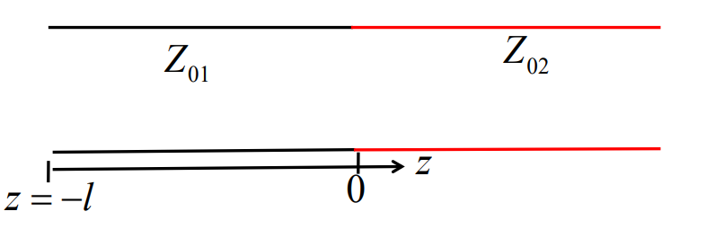
$$
\left\{ \begin{array}{l}
	\dot{U}^++\dot{U}^-=\dot{U}',电位连续\\
	\dot{I}^++\dot{I}^-=\dot{I}',电流连续\\
\end{array} \right.
$$
反射系数与透射系数
$$
\Gamma=\frac{\dot{U}^-}{\dot{U}^+}=\frac{Z_{02}-Z_{01}}{Z_{02}+Z_{01}} \\
T=\frac{\dot{U}'}{\dot{U}^+}=\frac{2Z_{02}}{Z_{02}+Z_{01}}
$$
行波状态
$$
\Gamma=0 \\
振幅不变、能量效率最高、电压电流同相位
$$
驻波状态
$$
|\Gamma|=1\\
负载处短路、开路、纯电抗
$$

行驻波
$$
0\lt|\Gamma|\lt 1
$$
驻波比
$$
S=\frac{1+|\Gamma|}{1-|\Gamma|} \\
第一个最大值位置:|z|_{\max1}=\frac{\phi_L }{4\pi}\lambda \\
第一个最小值位置:|z|_{\min1}=\frac{\phi_L }{4\pi}\lambda+\frac{\lambda}{4} \\
$$

### 入端阻抗

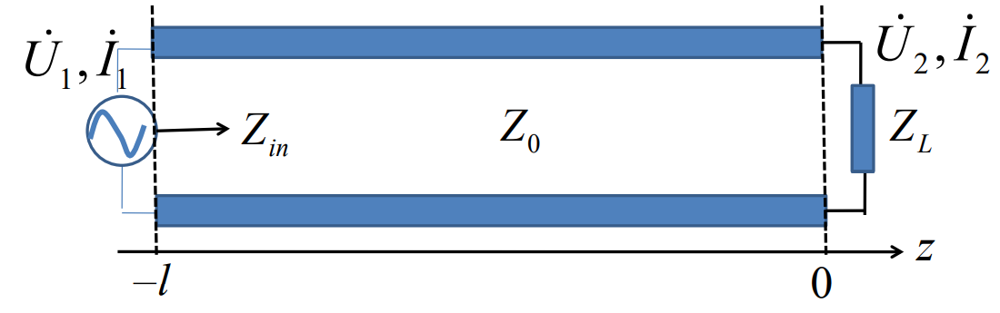
$$
Z_{in}=\frac{\dot{U}_1}{\dot{I}_1}=\frac{\dot{U}(-l)}{\dot{I}(-l)}=Z_0\frac{Z_L+jZ_0\tan\frac{2\pi}{\lambda}l}{Z_0+jZ_L\tan\frac{2\pi}{\lambda}l}
$$

#### 阻抗匹配

当$Z_0 =Z_L$时,$Z_{in}$始终等于$Z_0$

#### 终端短路

$Z_L=0$
$$
Z_{in}=jZ_0\tan\beta l=jX_i \\
$$
$X_i\gt 0$ 呈感性

$X_i\lt 0$ 呈容性

$X_i=0$ 电感电容串联

$X_i=\pm \infin$ 电感电容并联

#### 终端开路

$Z_L=\infin$
$$
Z_{in}=-jZ_0\cot\beta l=jX_i
$$

#### 终端纯电抗

$$
Z_{in}=jX
$$

#### 终端纯电阻

$$
R_L>Z_0:R_L=SZ_0 \\
R_L<Z_0:R_L=\frac{Z_0}{S}
$$

### 阻抗匹配

$\frac{\lambda}{4}$阻抗变换器

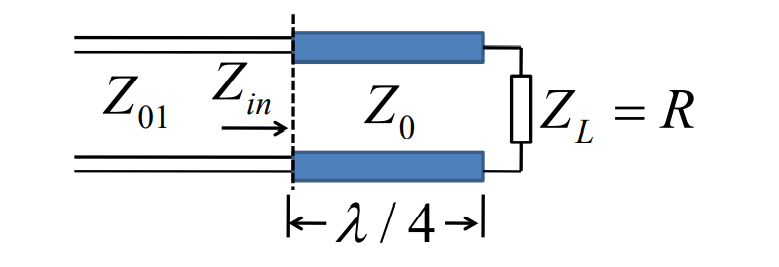
$$
Z_{in}=Z_0\frac{Z_L+jZ_0\tan\beta l}{Z_0+jZ_L\tan\beta l}\\
l=\frac{\lambda}{4}\\
Z_{in}=\frac{Z_0^2}{R}
$$
欲使阻抗匹配
$$
Z_{in}=Z_{01} \\
\therefore Z_0=\sqrt{RZ_{01}}
$$
若负载不为纯电阻

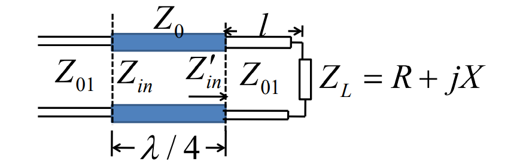

则需求解$l$,使得$Z_{in}'$为纯电阻
$$
Z_{in}'=Z_{01}\frac{(R+jX)+jZ_{01}\tan\beta l}{Z_{01}+j(R+jX)\tan\beta l}
$$
单短截线变换器

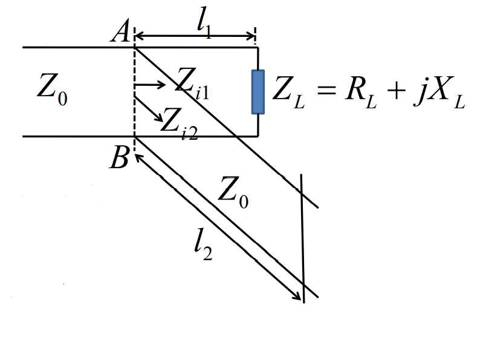
$$
\frac{1}{Z_0}=\frac{1}{Z_{i1}}+\frac{1}{Z_{i2}}\\
$$
需满足
$$
\frac{1}{Z_{i1}}=\frac{1}{Z_0}+jB_{i1}\\
\frac{1}{Z_{i2}}=-jB_{i1} \\
$$
其中
$$
Z_{i2}=jZ_0\tan\beta l_2 \\
Z_{i1}=Z_0\frac{Z_L+jZ_0\tan\beta l_1}{Z_0+jZ_L\tan\beta l_1}
$$

